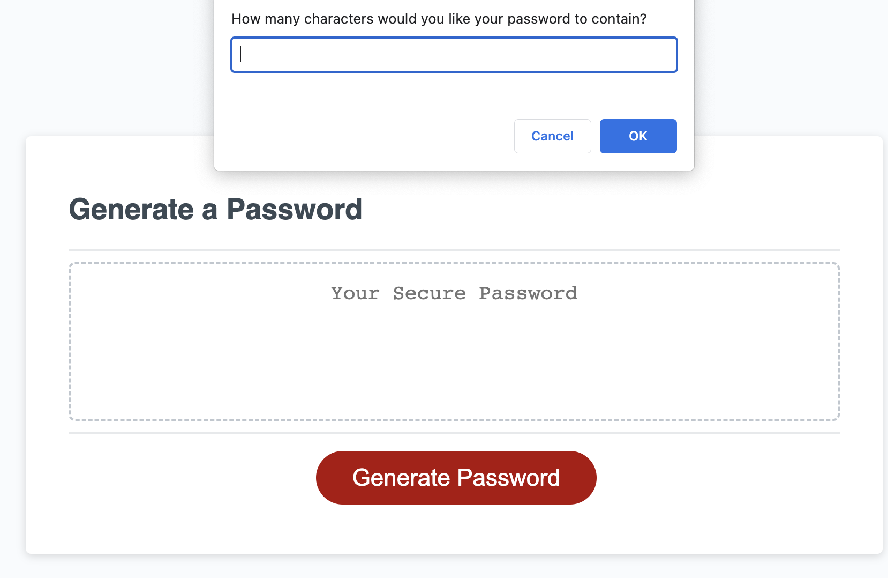
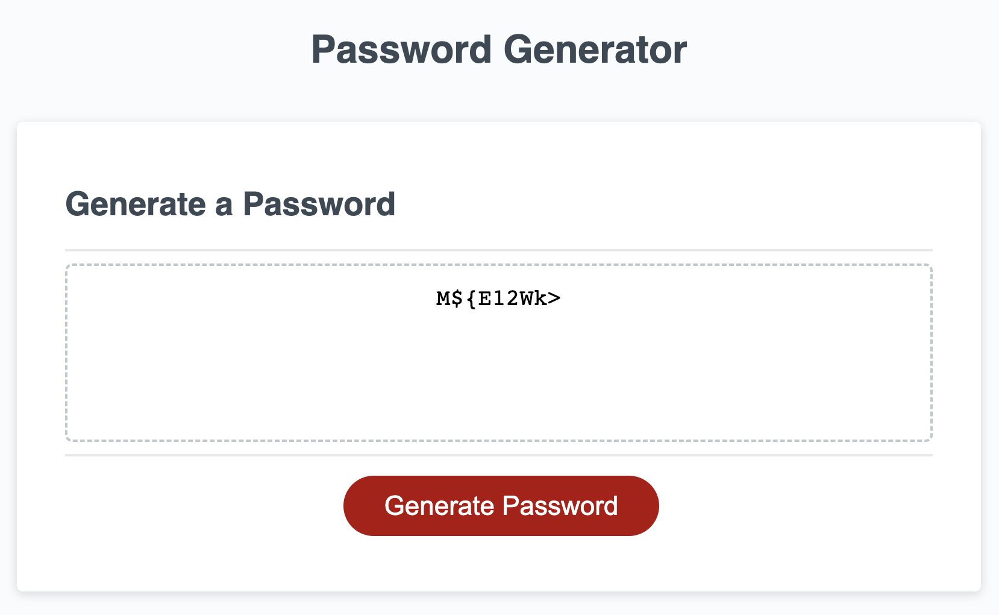

# Password-Generator

## Description

- This is the third challenge.
- The purpose of this repository is to enable a user to generate a random password that meets certain criteria.

## Usage

[Click here](https://hbarry89.github.io/Password-Generator/) to navigate to the live link of this repository.

- User will be presented with a series of prompt to genereate a random password:

## Credit

### Resources
- Bootcamp Materials
- W3 Schools
- Pseudo Code provided by TA in class
- Worked with TA, Tutor, and study groups.
- Special Character List [Here](https://owasp.org/www-community/password-special-characters)
- JavaScript Tutorial for Beginners [Video](https://www.youtube.com/watch?v=W6NZfCO5SIk)

### Applications Used
- VS Code

## Thank you for visiting!
